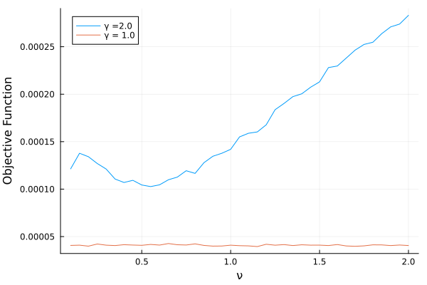
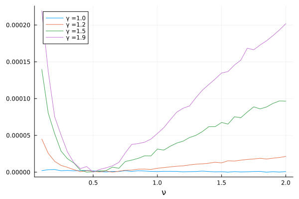

I recently learned about simulated based estimation and we had a very interesting discussion in class about one limitation of this. I decided to come up with an example to illustrate the issue and I think it is worth sharing. This post will be in English - unlike every other post so far - because this discussion was in English.

I will start explaining what simulation based estimation is to let everyone understand the example. 

# Simulation Based Estimation

A lot of models in economics do not have closed form solutions. This blog has seen a ton of examples of this in the form of a household that lives forever. We always solve it by some form of iteration of value function or using the first order conditions to approximate the consumption function. 

This makes life pretty hard because we can't tell what is the closed form of things, and even if we make things really tightly parametrized in the stochastic side - say, assuming every shock is normal - we still have some sort of mess. This closes the possibility of writing a likelihood. We are sometimes gitfed with moments and we can use the Generalized Method of Moments (GMM), but even that is problematic sometimes. 

To be somewhat specific, lets think of your average macro household problem: it can consume $C_t$, work $N_t$ hours and save buying bonds $B_t$ that pays interest rate $b_{t+1}$:

$$
\max_{\{C_t\},\{N_t\},\{b_{t+1}\}} \sum_{t=0}^{\infty} \beta^t \frac{C_t^{1-\gamma}}{1 - \gamma} + \varphi \frac{(1 - N_t)^{1-\nu}}{1-\nu} \text{ subject to } C_t + b_{t+1} = (1+r_t) b_{t} + w_t N_t
$$
This problem has first order conditions and these imply some moment conditions, so we could use GMM. But this is not always available.

The idea of the simulated based estimation is that different parameter values of the model we can't estimate implies different behavior, and then we might be able to get a simpler model that we can estimate and that we can work backwards to find the value of the parameter that is equivalent to that.

Lets call the model we are _really_ interested $M_0$ and the model we can estimate $M_d$ (reader, I do feel tempt to call them structural model and reduced form model, but I won't)

If the discussion above is too abstract, think about the macro model I wrote above. Lets say we are interested in estimating $\nu$. The first order conditions of the model give us:

$$
C_t^{-\gamma} w_t = \varphi(1 - N_t)^{-\nu}
$$

In fact $\nu$ is the inverse of the elasticity of leisure with respect to wages. So, we would expect that a regression of hours on wages would yield relevant information about this parameter, even though the model is highly non linear. So, $M_d$ here is the very simple regression of hours on wages and $M_0$ is a dynamic programming problem. 

Our simulation based estimation could draw a vector of parameters $\gamma$, $\nu$, $\varphi$ and $\beta$, and create a fake time series of labor supply with observed wages. Then, we would regress wage on the fake labor supply and compare its regression coefficient with the regression coefficient I get from actual data. A good candidate for $\gamma$, $\nu$, $\varphi$ and $\beta$ is any series that makes the fake coefficient close to the real coefficient. Of course, we will allow some shocks in the labor supply and maybe we draw a _very weird_ labor supply. So, as always, we repeat this simulation a bunch of times and take the average distance estimator of $\beta$ from the fake data.   

# The issue

The big issue here is _how good_ is $M_d$ in describing $M_0$. We can think that what we are doing parameters from the model $M_d$- call them $\beta_{M_d}$ - and writing them as a function of parameters of the original model, so $\beta_{M_d} = f(\beta_{M_0})$. The challenge here is, having some estimate $\hat{\beta}_{M_D}$, to do $\hat{\beta}_{M_0} = f^{-1}(\hat{\beta}_{M_D})$. If the function $f$ "is bad", then we are in trouble. One simple way of the function to be bad is that it is not into, i.e. two structural parameters lead to the same reduced form. A more subtle way of getting problems is that f is one to one, but large changes in the parameters $\beta_{M_0}$ only leads to small changes in the parameter $\beta_{M_D}$

The whole discussion of $f$ being a one to one function rules out the possibility of recovering $\gamma$, $\nu$, $\varphi$ and $\beta$ from only one regression coefficient. There are too many parameters in the model $M_0$, and maybe many combinations of them will yield the same parameter $M_d$. Hence, we will focus on only recovering $\nu$

# The example

The example is exactly a household problem from the macro model above, but since I don´t want to solve a dynamic programming problem every time - which would be incredibly time consuming - I will make it a single period problem. Hence, the household consumes everything they can buy with their wages. 

The fun thing about this example is that, if $\gamma = 1$, we have log utility. And with log utility, the effect of wages on labor supply is zero: the income and substitution effect cancel out. This means that a higher wage won't change hours, no matter the value of $\nu$.

Since this requires a lot of simulations, I will do everything in Julia. The first function just creates the household problem for one period and solves it. I add the additional complication of having varying intensity of work and this adds a Markov Chain - think of unemployment and employment. 

```julia

function simulate_one_period(γ,ν,ϕ,state,w, transition_matrix)

    if state == 0
        eff_wage = 1/2*w
    else
        eff_wage = 1
    end

    f(n) = eff_wage*(n*eff_wage)^(-γ) - ϕ*(1-n)^(-ν)

    n_star = find_zero(f,(0.01,1))

    C = n_star*eff_wage + 0.1*randn()

    n_obs = n_star*(1+0.1*randn())

    draw = rand(U_dist)

    index = state + 1
    if draw < transition_matrix[index,index]
        new_state = state
    else
        new_state = 1 - state
    end

    return C, n_star, n_obs, new_state
end

```

I add some random noise in the consumption (which doesn't come to play in any way here) and the employment, and I keep the real employment `n_star` and the noisy version `n_obs`. I will focus on `n_obs` throughout. Lets create one household, and in true macro fashion, we assume it is the whole economy:

```julia

function simulate_history(T,γ,ν,ϕ,transition_matrix)

    data = zeros(T,4)
    wage = 1
    state = 1
    wage_shock = Gamma(1.5,0.5)

    for t = 1:T
        C, n_star, n_obs, state = simulate_one_period(γ,ν,ϕ,state,wage,transition_matrix)
        data[t,:] = [C n_star n_obs wage]
        wage = 0.8*wage + rand(wage_shock)
    end

    return data

end

```

A single run of this would be obtained by running the code bellow, and we use the matrix $\Pi$ as the transition matrix, have 200 observations, $\gamma = 2$, $\nu = 0.5$ and $\varphi = 1$:

```julia

Π = [0.8 0.1;0.3 0.7]

data = simulate_history(200,2.0,0.5,1,Π)

```

We could get one very simple regression of wages over hours by doing:

```julia 

x = [ones(size(data,1)) data[:,4]]

β = inv(x'x)*x'data[:,3]

```

Now, to the simulation based estimation part. We first create a function that will take the parameters and create a fake economy. Since I know exactly the data generating process of the wage - I created it! - I allow a new wage draw from every simulation run. It then runs a regression of wages over labor supplied and just returns the coefficient associated with the slope of wage:

```julia

function simulate_method_of_moments(T,γ,ν,ϕ,transition_matrix)

    fake_data = simulate_history(T,γ,ν,ϕ,transition_matrix)
    x = [ones(size(fake_data,1)) fake_data[:,4]]
    β = inv(x'x)*x'fake_data[:,3]

    return β[2]

end

```

I am really reusing the same function I used to create the data to create the fake data for the simulation. This is how lazy I am. 

To estimate, I need to measure the distance from the regression coefficient obtained by simulation. Since I want to even out any funny things caused by the simulation, I will create many fake economies and then take the mean of the estimated regression coefficient across these many simulations.

The last thing is to measure the distance, and squared distances never let me down:

```julia

function objective_function(H,T,γ,ν,ϕ,transition_matrix,real_b)

    many_bs = ThreadsX.map(z->simulate_method_of_moments(T,γ,ν,ϕ,transition_matrix), 1:H) |> mean

    Δ = many_bs - real_b

    return Δ'Δ

end

```

If you are not used to the `map` command, it works just like a for loop to repeat the function $H$ times. Using the `ThreadsX.map` allows me to seamless run the code in parallel. 

Here is a function that ties everything together and returns the value of the objective function over a grid of values of $\nu$, so we can see how badly behaved our map from parameters in $M_d$ to $M_0$ is:

```julia

function full_sim_nu(H,T,γ,ν,ϕ,transition_matrix,grid)

    data = simulate_history(T,γ,ν,ϕ,transition_matrix)
    x = [ones(size(data,1)) data[:,4]]

    β_real = inv(x'x)*x'data[:,3]

    curvature = map(ν->objective_function(H,T,γ,ν,ϕ,transition_matrix,β_real[2]),grid)

    return curvature

end

```

I will work with two cases, one in which $\gamma = 1$ and another in which $\gamma = 2$. They are called, respectively, bad case and good cases. Again, to average out any variations due to the different economies we create, we average a 100 cases:

```julia

bad_case = ThreadsX.map(z->full_sim_nu(50,200,1.0,0.5,0.5,Π,nu_grid),1:100) |> x->reduce(hcat,x)

p = Progress(100)
good_case = ThreadsX.map(1:100) do t

    res = full_sim_nu(50,200,2.0,0.5,0.5,Π,nu_grid)
    next!(p)
    res

end

good_case = reduce(hcat,good_case)

```

Long time readers would notice that a 100 is not that much. But remember, each of this replications has 50 replications inside it. Even running in parallel it takes 15 minutes each. We still need to do some data cleaning and taking means of each function:

```julia

bad_case2 = permutedims(bad_case) |> x->mean(x,dims=1)
good_case2 = permutedims(good_case) |> x->mean(x,dims=1)

```

Here is the picture worth a thousand words:

```julia

plot(nu_grid,permutedims(good_case2), label = "γ =2.0") |> display
plot!(nu_grid,permutedims(bad_case2), label = "γ = 1.0") |> display
xlabel!("ν") |> display
ylabel!("Objective Function") |> display

```



For the case $\gamma = 2.0$ the function has a nice valley around 0.5, which is the true parameter value. For $\gamma = 1$, the function is completely flat!

What happens if we slowly change $\gamma$ from 1.0 to 2.0? I set a grid of 0.1 (believe me, even this coarse grid took two hours):

```julia

gamma_grid = 1:0.1:2

many_nu(P,H,T,γ,ν,ϕ,transition_matrix,grid) = (ThreadsX.map(z->full_sim_nu(H,T,γ,ν,ϕ,transition_matrix,grid),1:P) |> x->reduce(hcat,x) |> x->mean(x,dims=2))

many_surfaces = mapreduce(γ->many_nu(300,10,200,γ,0.5,1,Π,nu_grid),hcat,gamma_grid)

```

For those of you unfamiliar with `mapreduce`: it applies the function a bunch of times for every value in `gamma_grid` - just like map does - and then joins all the data it generated using `hcat` - hence reduces whatever it obtained. In the end, we have a matrix with the number of rows equal to the size of `nu_grid` and with number of columns equal to `gamma_grid`, and we can make the following picture:

```julia

plot(nu_grid,many_surfaces[:,1].- minimum(many_surfaces[:,1]),label = string("γ =", gamma_grid[1])) |> display
plot!(nu_grid,many_surfaces[:,3] .- minimum(many_surfaces[:,3]),label = string("γ =", gamma_grid[3])) |> display
plot!(nu_grid,many_surfaces[:,6].- minimum(many_surfaces[:,6]),label = string("γ =", gamma_grid[6])) |> display
plot!(nu_grid,many_surfaces[:,10].- minimum(many_surfaces[:,10]),label = string("γ =", gamma_grid[10])) |> display
xlabel!("ν") |> display

```



I made sure the minimum is always on zero to make it very clear how much curvature we gain. The gain from $\gamma = 1.2$ to $\gamma = 1.5$ is expressive. 

This was fun and I am particularly proud of coming up with an example with economic meaning _and_ a parameter that smoothly changes and allows us to gain or lose identification. Econometricians are proud of funny things...