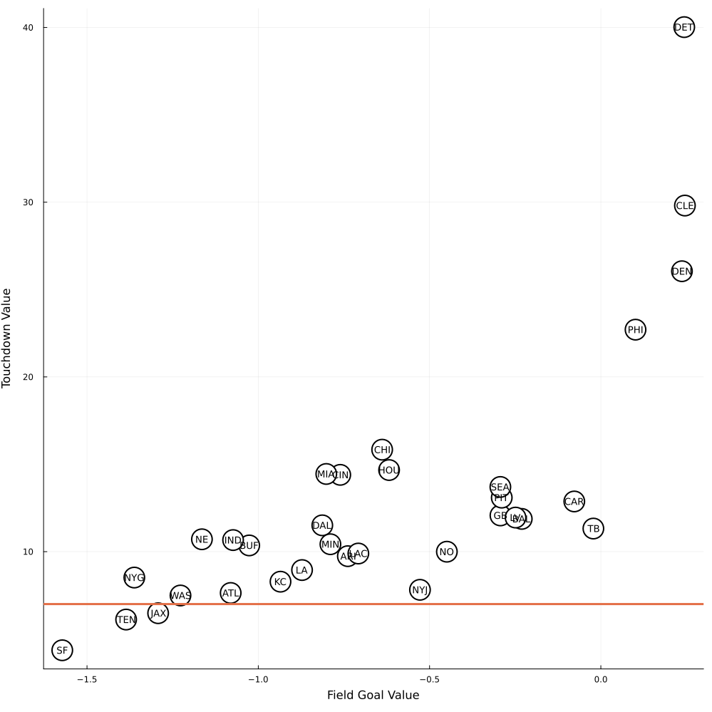

```{r,echo=FALSE,results='hide'}

library(JuliaCall)

```

[Last post](../post/2025-12-29-bellman-mcfadden-walk-into-a-sports-bar-part-1/index.en-us.Rmd) we talked about all the data cleaning I did to get some key statistics to estimate the model. Now we are going to deal with the model itself.

Recall that there are three choice: punting, kicking a field goal and going for it. We are going to estimate how much each team values field goals (we will call this value $\tau_1$) and how much they value touchdowns ($\tau_2$). Only going for it requires we think about the value function, and I will model this simply as:

$$
P(\text{Touchdown}) \tau_2 + \rho E[V(\text{yards}',\text{yards to go}',\text{downs}')] + (1-\rho)E(\text{yards})
$$


$\rho$ is the probability of a turnover (fumble or intercept) and $E(\text{yards})$ is the expected number of points by an opponent in case of a turnover. It is very convenient to have $\rho$ because it works just like a discount rate in the usual problems we see with value functions. We are taking the expectation because the number of yards next play, $\text{yards}^{\prime}$, is unknown, and so are yards to go and if we have a new set of downs. These are all determined by the new yards, and this was saved in the previous post.

Since we are going to set 0 as a punt, 1 as a field goal attempt and 2 as going for it, we can write:

$$
V(\text{yards},\text{yards to go},\text{downs}) = \begin{cases}
E(\text{yards}-40) & \text{if } \text{choice} = 0\\
P(\text{Field goal at Yards})\tau_1 + (1 - P(\text{Field goal at Yards}))E(\text{yards}) & \text{if } \text{choice} = 1\\
P(\text{Touchdown}) \tau_2 + \rho E[V(\text{yards}',\text{yards to go}',\text{downs}')] + (1-\rho)E(\text{yards}) & \text{if } \text{choice} = 2\\
\end{cases}
$$
The minus 40 yards has two aspects: 40 yards was selected as a calibrated value - we could estimate it from the data, but anyway. The minus is since the 0 yards is the opponent's end zone from our point of view. Of course, the head coach chooses the option that yields the most points for him.

The value function turns out to be a bit complicated. The problem is acessing the values: once yards to go get to 0, two things happen: one, we now need 10 yards to go; two, we get a fresh set of downs. There is a function that only deals with this access:

```{julia}

function nice_V(yards,yards_to_first,downs,probs,Vprime)

    V2 = DiffCache(zeros(100)) |> x-> get_tmp(x,Vprime)

    p_temp = subset(probs, :ydstogo => ByRow(x->x==yards_to_first)) |> x->subset(x, :yardline_100 => ByRow(x->x==yards))

    if nrow(p_temp) == 0
        return 0
    elseif nrow(p_temp) == 1
        y_prime = p_temp.new_yards[1]
        if y_prime <= yards - yards_to_first #first down case
            V2_aux = Vprime[y_prime,11,1]
        else #not a first down
            Δ = y_prime - yards
            if yards_to_first + Δ <= size(Vprime,2)
                V2_aux = Vprime[y_prime,yards_to_first + Δ,downs+1]
            else
                V2_aux = 0
            end
        end #if yards_to_first + Δ <=

        return V2_aux
    end

    num_nei = min(ceil((nrow(p_temp)-1)/2),4) |> Int
    prob_foo = nearest_neigh(p_temp.new_yards,p_temp.prob_ker2,1:100,num_nei,:uniform)
    prob_foo = prob_foo ./ sum(prob_foo) #guarantees the probabilities sum 1

    for y_prime = 1:100
        if y_prime <= yards - yards_to_first #first down case
            V_temp = Vprime[y_prime,11,1]
            V2[y_prime] = prob_foo[y_prime]*V_temp
        else #not a first down
            Δ = y_prime - yards
            if yards_to_first + Δ <= size(Vprime,2)
                V_temp = Vprime[y_prime,yards_to_first + Δ,downs+1]
                V2[y_prime] = prob_foo[y_prime]*V_temp
            else
                V2[y_prime] = 0
            end
        end #if yards_to_first + Δ <=
    end #for

    return sum(V2)

end

```

Another detail of the game that requires some care is the punting. Again, I am going to assume that every punt achieves 40 yards, and we need to be careful about the touchback rule:

```{julia}

function punt_foo(yards,expected_points_foo)

    new_yards = yards - 40 # hard coding 40 yards, we can change it in the future

    if new_yards <= 0 # Touchback, complicated rule, lets focus on 2024
        new_yards = 30
    end

    return -expected_points_foo[new_yards]

end


```

The real star is the value function, and it needs to do many things: how many points we get at each choice, the value of the state variables, and all the probabilities of converting a field goal, getting a touchdown, etc. 

```{julia}

function value_function(choice,τ1,τ2,yards,yards_to_first,downs,probs_trans,prob_fieldgoal_foo,prob_td_foo,expected_points_foo,Vprime,ρ = 1)

    if downs == 5 #loss on downs
        return expected_points_foo[yards]
    end

    if choice == 0 # choice zero: punts
        return punt_foo(yards,expected_points_foo)
    end

    if yards < 0
        return τ2
    end

    if choice == 1 #attempts a field goal
        return τ1*prob_fieldgoal_foo[yards]-(1 - prob_fieldgoal_foo[yards])*expected_points_foo[yards]

    end

    if choice == 2 #continue playing
        V = nice_V(yards,yards_to_first,downs,probs_trans,Vprime)
        return τ2*prob_td_foo[yards] + (1-prob_td_foo[yards])*ρ*V - (1 - ρ)*expected_points_foo[yards]
    end
end


```

I am going to do use the usual multinomial logit that can be justified as each shock comming from the Generalized Extreme Value distribution. This yields a "closed form" estimator (a closed form of the integral needed, actually) and frees us from simulating shocks to get the solution: the value function solution is easy and everything is really fast.

It is very easy to create the probabilities of selection of each option:

```{julia}

prob_clm(vs) = exp.(vs)/sum(exp.(vs))


```

There are now two crucial functions: one will yield the probability of the head coach taking either of the three options available to him; and the other will yield the solution of the value function by iteration. We are only able to get the probability of the choice because it depends on an unobserved shock. One could think of doing a grid of the values each of the shocks can take and add them to the state variables. But we never observe these shocks and it would increase the number of states and make the problem a mess! In the end, we don't need it - bear with me for a moment. We solve for the three state variables, and I use the ThreadsX package to run the largest grid (yards) in parallel.

```{julia}

function max_value2(τ1,τ2,yards,yards_to_first,downs,probs_trans,prob_fieldgoal_foo,prob_td_foo,expected_points_foo,Vprime,ρ=1)

    utilities = map(c->value_function(c,τ1,τ2,yards,yards_to_first,downs,probs_trans,prob_fieldgoal_foo,prob_td_foo,expected_points_foo,Vprime,ρ),0:2)
    choice_prob = prob_clm(utilities)

    return choice_prob, utilities

end

function solve_value2(τ1,τ2,probs_trans,prob_fg_foo,prob_td_foo,expected_points_foo,V0,ρ;maxiter = 1000)

    V = DiffCache(V0) |> x-> get_tmp(x,τ1)
    choice = copy(V0)
    γ = MathConstants.eulergamma

    j = 0
    err = 1

    while j < maxiter && err > 1e-9
        V_old = copy(V)
        R = log.(sum(V_old,dims=2)) .+ γ |> x->dropdims(x,dims=2)
        for k = 1:size(V,2),l = 1:4
            aux = ThreadsX.map(y->max_value2(τ1,τ2,y,k,l,probs_trans,prob_fg_foo,prob_td_foo,expected_points_foo,R,ρ),1:100)
            V[:,:,k,l] = permutedims(mapreduce(i->exp.(aux[i][2]),hcat,1:100))
            choice[:,:,k,l] = permutedims(mapreduce(i->aux[i][1],hcat,1:100))
        end
        j+= 1
        err = maximum(abs.(log.(sum(V,dims=2)) - log.(sum(V_old,dims=2))))
        #println(string("Iteration: ",j,"\n Error: ", err))
    end
    return choice, V

end


```

All of this is to create the utility and value functions we need. We are finally ready to write the likelihood. It takes the play by play data and all our inputs from the previous post and estimates $\tau_1$ - the value of a field goal - and $\tau_2$ - the value of a touchdown. To start the value function iteration, we start everything in 1 _except_ the "fifth" down, in which we used the expected points from turning the ball over at that yardage. 

```{julia}

function loglikehood(τ1,τ2,data,probs_trans,prob_fg_foo,prob_td_foo,expected_points_foo,ρ)

    V_zero = DiffCache(ones(100,3,17,5)) |>x-> get_tmp(x,τ1)

    for i = 1:100

        V_zero[i,:,:,5] .= exp(-expected_points_foo[100-i+1])

    end


    γ = MathConstants.eulergamma
    choice, value = solve_value2(τ1,τ2,probs_trans,prob_fg_foo,prob_td_foo,expected_points_foo,V_zero,ρ)
    R = log.(sum(value,dims=2)) .+ γ |> x->dropdims(x,dims=2)

    p = DiffCache(zeros(nrow(data))) |> x->get_tmp(x,τ1)

   for i = 1:nrow(data)
       u = value_function(data.decision[i],τ1,τ2,data.yardline_100[i],data.ydstogo[i],data.down[i],probs_trans,prob_fg_foo,prob_td_foo,expected_points_foo,R,ρ)
       probs, vals = max_value2(τ1,τ2,data.yardline_100[i],data.ydstogo[i],data.down[i],probs_trans,prob_fg_foo,prob_td_foo,expected_points_foo,R,ρ)

       p[i] = max(min(exp(u)/sum(exp.(vals)),1),0.0001)

   end

    return mean(log.(p))

end

```

The loglikelihood maximization works as follows: draw a number for $\tau_1$ and $\tau_2$, solve the value functions and calculate probability of each play. Move towards regions of higher probability.

In the last post, I talked about the need to interpolate (and extropolate) the data we have on probabilities of field goal and touchdowns. To do this, I will use a nearest neighboor estimator: the probability of a field goal or touchdown depends on the value of the $m$ nearest yards. It is very easy to do this in a function, and I programmed many ways of weighting these points. We could weight them equally, or farther points out with less weight (think of the case of 10 yards in which the closest points are 11 yards and 40 yards. One of these is not like the other!). The function interpolates, then takes the new xs and return the values of the function at these points:

```{julia}

function nearest_neigh(x,y,new_x,nh, weights)

    new_y = zeros(length(new_x))

    for i = 1:length(new_x)

        dists = abs.(x .- new_x[i])
        nearest_neighboors = sortperm(dists) |> z->z[1:nh]

        if weights == :uniform
            ws = fill(1/nh,nh)
        elseif weights == :prop
            ws = 1 ./(1 .+ dists[1:nh])
        elseif weights == :prop2
            ws = 1 ./(1 .+ dists[1:nh])
            ws = ws/sum(ws)
        else
            error("Weights unimplemented:")
        end

        new_y[i] = sum(ws.*y[nearest_neighboors])
    end

    return new_y
end


```


We have a ton of files to load, some strategies to deal with extrapolation and we still have some problems with the data: for some teams and some yards, all field goals are converted. However, it is unrealistic to believe that a field goal is a certainty at that distance. All of these will all be wrap in a function that receives a three letter code of the team, which is standarized in the original dataset, and load the files, do the interpolations and run the maximum likelihood:

```{julia}

function estimate(team)

    prob_fg = CSV.read(string("./data/field_goal_probs_",team,".csv"), DataFrame, missingstring = ["NA"])
    dropmissing!(prob_fg)

    prob_fg_foo2 = nearest_neigh(prob_fg[:,2],prob_fg[:,3],1:100,4,:prop2)

    # Nearest Neighbor sets a probability of a fg too high. We fix this: probability decays after the longest one

    longest_fg = findlast(prob_fg.prob .!= 0)
    for i = (longest_fg+1):100
        prob_fg_foo2[i] = 1/(i-longest_fg)*prob_fg_foo2[longest_fg]
    end

    prob_fg_foo3 = copy(prob_fg_foo2)
    prob_fg_foo3[(longest_fg+1):100] .= 0
    prob_fg_foo3[prob_fg_foo3 .>= 1] .= 0.98

    prob_td = CSV.read(string("./data/touchdown_probs_",team,".csv"), DataFrame, missingstring = ["NA"])

    dropmissing!(prob_td)

    prob_td_foo2 = nearest_neigh(prob_td[:,2],prob_td[:,3],1:100,4,:prop2)

    probs_cont = CSV.read(string("./data/prob_trans_",team,".csv"), DataFrame, missingstring = ["NA"])

    dropmissing!(probs_cont)

    data = CSV.read(string("./data/pbp_data_",team,".csv"), DataFrame, missingstring = ["NA"])

    dropmissing!(data)

    def_data = CSV.read(string("./data/defense_data_",team,".csv"), DataFrame, missingstring = ["NA"])

    dropmissing!(def_data)
    unique!(def_data, :yardline_100)

    expected_points_foo = nearest_neigh(def_data[:,2],def_data.expected_points,1:100,6,:prop2)

    ρ_hat = subset(data, :decision => ByRow(x->x==2)) |> d->mean(d.fumble + d.interception) |> z-> 1-z

    op = optimize(θ->-loglikehood(θ[1],θ[2],data,probs_cont,prob_fg_foo3,prob_td_foo2,expected_points_foo,ρ_hat),[3.0;7.0])

    return DataFrame(team = fill(team,3),what = ["ρ","FG","TD"], values = [ρ_hat;op.minimizer])

end


```

The field goal probabilities are thinkered. First of all, the probabilities that are equal to 1 are (arbitrarily) reduced to 0.98; the probability of a field goal for a distance farther than the longest field goal in the data decays hyperbolically:  

```{julia}

using Plots, CSV, DataFrames

prob_fg = CSV.read("field_goal_probs_SF.csv", DataFrame, missingstring = ["NA"])
dropmissing!(prob_fg)

prob_fg_foo2 = nearest_neigh(prob_fg[:,2],prob_fg[:,3],1:100,4,:prop2)

    # Nearest Neighbor sets a probability of a fg too high. We fix this: probability decays after the longest one

longest_fg = findlast(prob_fg.prob .!= 0)
for i = (longest_fg+1):100
    prob_fg_foo2[i] = 1/(i-longest_fg)*prob_fg_foo2[longest_fg]
end

plot(1:100,prob_fg_foo2, label = "Probability of Field Goal")

```


We can now estimate this for many teams. The orange lines show the true values in points of a play:



There are many interesting things here. First, most teams have a negative value for the field goal. This is bizarre, but recall that this is the value over a punt. This just says that most teams put the value of a field goal below the value of a punt. Teams settle for field goals; they don't want them. This is the conventional wisdom of the game.

Most teams value a touchdown above the true value of it. The 49ers are the team bellow it, but in the 2024 season they had a terrible time converting touchdowns and settle for a ton of field goals - and finished last in their division, behind the Cardinals. Other teams with very little value for touchdowns are the terrible Jets, Tennessee (last in AFC South), Giants (last in the division). Atlanta finished second in the terrible, no good, NFC South. They had a losing record, but they did better than New Orleans and Carolina. Both of these teams did worst than Atlanta and somehow value both field goals and touchdowns more. This is not a big mystery: the only way to justify the success rate at these plays and the decision to go ahead is if these plays were seen as worth a lot more than they were to other teams. Another way to say the same thing: Carolina and New Orleans played so badly that the only way to justify their coaches decision is if each touchdown counted for at least 10 points. Yikes.

The weird guy out is Washington, that is sitting in the ugly duckling corner and made to the playoffs. They valued touchdowns a bit less than Kansas Chiefs, according to the model - and the chiefs made to the superbowl! The model ignores personal, and 2024 was the first season that Jayden Daniels played as QB. With a rookie quarterback, a coach would be very tempted to undervalue touchdowns. Chicago overvalued touchdowns with a rookie quarterback and ended up with a losing record. 

The elephant in the room (plot?post?model?) is the Detroit Lions. According to the model, they value a touchdown at around 5 times its actual value. This seems insane. And yet, there is not a pundit in the land that wouldn't agree that Dan Campbell is [aggressive](https://www.mlive.com/lions/2023/09/ever-wonder-where-dan-campbells-aggressiveness-comes-from-here-you-go.html). Here is a quote:

>In Year 1, Campbell went for more fourth downs than any other coach in league history. He’s also faked more punts than any other head coach in the league since taking over in Detroit, and did it twice as many times as the next-closest team last season.

So, the model sees a coach that, instead of punting on fourth downs, goes for it. The only way to justify this boldness, goes our model, is to believe that touchdowns are worth a lot. Like a lot lot. This is not a bug in the model, it is a feature. 

After doing this estimation exercise, I got really happy and really intrigued. First of all, this is a fairly interesting model to write and estimate. It takes a few minutes to run for all NFL teams. It is not all over the place, and we can make some sense out of the results.

And yet it is very unsatisfactory becuse it yields a negative value for field goals, it puts most teams giving more value to a touchdown than it is actually worth and some teams seem to value it way of the scale. It is interesting. Yet strangely unhelpful.

So, the third post will deal with plan B - and as most plan B, it is much more work. We are going to estimate the probabilities of touchdown and field goal themselves.
