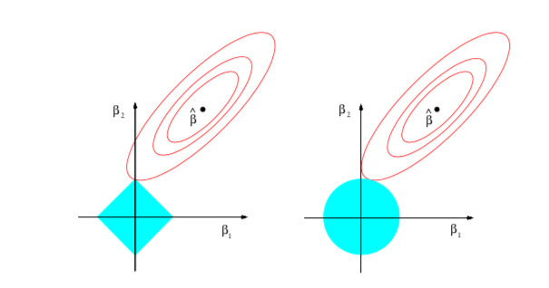

Este post vai tratar de um método de machine learning muito interessante e relativamente simples: o LASSO. LASSO significa *Least Absolute Shrinkage and Select Operator*. Como o nome sugere, o LASSO **seleciona quais regressores são relevantes e quais não são**. Ou seja, suponha que você é um pesquisador que tem 50 variáveis que são possíveis candidatos a variáveis explicativas de uma variável de interesse. O LASSO permite que você dê os 50 regressores para o computador e ele escolha quais são os relevantes. O LASSO está centrado na ideia de *esparsidade*: poucos coeficientes vão ser diferentes de zero; poucas variáveis vão ser relevantes numa regressão.

Uma pergunta justa é: por que não simplesmente testamos isso "na mão"? Isso é, fazemos uma regressão com todas as variáveis, uma sem a primeira variável da base de dados, uma outra sem a segunda... e no fim vemos qual a melhor regressão? Além de problemas de teste - lembre que todo teste tem uma chance de você estar tomando a decisão *errada* - isso seria um inferno: com relés 50 variáveis, precisaríamos de $2^50$ regressões, ou seja, `r 2^50`. 

A ideia original vem de um paper de 1996 de Robert Tibshirani. Não temos solução fechada para encontrar o estimador de LASSO, ao contrário do MQO, onde podemos expressar o estimador como uma multiplicação de matrizes. Portanto, é um estimador que seria impossível sem um computador. Mas a ideia é incrivelmente simples.

Pegue o modelo usual de regressão, $y_i = X_i \beta + u_i$, onde $\beta$ é o coeficiente de interesse, $u$ é um choque aleatório, as observações são indexadas por $i = 1,...,n$ e os coeficientes são indexados por $k = 1,..,K$ . O objetivo do MQO é minimizar a soma dos quadrados dos resíduos, ou seja $\min_{\beta} \sum_{i=1}^n \hat{u}^2$. O LASSO começa dai, mas adiciona uma pequena alteração: vamos limitar o valor da soma dos valores absolutos dos coeficientes para que ele seja menor que uma constante $c$. Ou seja, o LASSO resolve o problema:

$$\min_{\beta} \sum_{i=1}^n \hat{u}^2  \text{ sujeito a }  \sum_{k=1}^K |\beta_{k}| < c$$

Veja que não temos como tirar a derivada da função módulo, e portanto não podemos resolver o problema "no braço".

Podemos reescrever o problema como um la grangeano: $\min_{\beta} \left( \sum_{i=1}^n \hat{u}^2 \right) - \lambda \left( \sum_{k=1}^K |\beta_{k}| \right)$, onde o $\lambda$ é o multiplicador de lagrange. Existe uma função que leva de $c$ para $\lambda$, então podemos ignorar o valor de $c$ e pensar só em termos de $\lambda$. Muitas implementações fazem isso e eu seguirei este caminho.

Veja que estamos trabalhando a soma do valor absoluto dos coeficientes. Chamamos isso de norma $\ell_1$. Aqueles que já fizeram um curso de algebra linear conhecem a norma $\ell_2$, conhecida como norma euclidiana: $\sum_{k=1}^K \beta{}^2$. Existe um método de estimação que usa a norma $\ell_2$ ao invés da $\ell_1$, conhecido como *ridge*. Usando a norma $\ell_2$, o problema tem solução analítica. Então, por que norma $\ell_1$, que parece ser tão ruim de trabalhar?

Esta é uma das belezas do LASSO: a norma $\ell_2$ **não** gera esparsidade. A norma $\ell_1$ gera. O motivo é ilustrado na figura abaixo, tirada de *Statistical Learning with Sparsity*, de Trevor Hastie, Robert Tibshirani and Martin Wainwright (cujo pdf, 100% legal, você encontra [aqui](https://web.stanford.edu/~hastie/StatLearnSparsity_files/SLS_corrected_1.4.16.pdf))



A imagem supõe que você só tem duas variáveis, por motivos ilustrativos. O $\hat{\beta}$ é o máximo global, o conhecido estimador de MQO. Em vermelho são as curvas de nível do estimador. O que o *Ridge* (à direita) faz é impor uma restrição no formato de uma bola (azul). Veja que a curva de nível encosta na bola fora do eixo vertical - onde $\beta_1$ seria zero. Já o *LASSO* é ilustrado na figura à esquerda. Veja que, nesse caso, a curva de nível acerta na quina da restrição, efetivamente zerando o coeficiente $\beta_1$.

Veja que, por enquanto, eu escondi o $\lambda$ (ou o $c$) debaixo do tapete: eu ainda não expliquei como escolher essa variável, que de fato está no centro do problema.  O pesquisador pode ter uma vaga ideia de quanto os coeficientes devem somar. Mas uma ideia exata do tamanho é complicada, então gostariamos de deixar os dados nos dizerem o $\lambda$ certo. Existem várias estratégias, e infelizmente o `glmnet` só implementa uma. 

Com alguma ideia do que o LASSO está fazendo, podemos colocar a mão na massa e discutir o pacote padrão para o LASSO no R, o `glmnet`. 

##O pacote glmnet

Obviamente, começamos carregando o pacote:

```{r}

library(glmnet)

```

O comando para rodar uma regressão usando o LASSO é o `glmnet`. Ele recebe basicamente duas coisas, uma matriz com regressores e o vetor que é a variável dependente. Até ai, muito parecido com o MQO. Mas a grande diferença em termos de output é que o `glmnet` devolve uma *matriz* de coeficientes. O que o `glmnet` faz é estimar o modelo para um vetor de $\lambda$, de tal forma que você vá de nenhuma variável incluida no modelo até todas as variáveis. Isso não significa que cada $\lambda$ estimado adicione uma variável nova ao modelo: em alguns casos o LASSO não seleciona mais ninguém, mas como ele tem mais "orçamento" para alocar, ele aumenta o valor dos coeficientes das variáveis incluídas. O `glmnet` resolve o problema de escolher qual $\lambda$ usar simplesmente estimando com vários valores diferentes.

Vamos testar o `glmnet` gerando uma matriz com 50 variáveis e 2000 observações e criando uma variável dependente que  depende só das 10 primeiras variáveis: 

```{r}

x <- matrix(rnorm(2000*50), ncol = 50) #regressores
betas <- c(rep(1,10),rep(0,40)) # as 10 primeiras serão relevantes com um coeficiente 1. As outras são irrelevantes - e portanto tem um coeficiente 0
y <- x%*%betas + rnorm(2000) 

modelo <- glmnet(x,y)
coef(modelo)[,1:5] # só pegando as 5 primeiras colunas. Veja que o comando summary não nos dá o que queremos no glmnet

```

Obviamente, ainda temos que selecionar qual dos modelos nós queremos. O pacote nos permite selecionar por *Cross Validation* (CV). Em linhas gerais, o que o Cross Validation faz é separar os dados em $k$ blocos - 5,10, ou até mesmo blocos de uma única observação (conhecido como *leave one out*). Depois, escolha $k-1$ blocos e estime o modelo usando o `glmnet`. Para avaliar qual $\lambda$ devemos usar, use o bloco que *não* foi usado para estimar para ver qual modelo gera o menor erro segundo alguma métrica (erro quadrático médio, por exemplo). O CV vai permitir com que cada bloco tenha uma chance de ser "fora da amostra".

Isso pode parecer muito computacionalmente intensivo - e de fato é - mas a implementação do glmnet é tão eficiente que normalmente num piscar de olhos o modelo é estimado. O comando que faz a seleção do $\lambda$ é o `cv.glmnet`. Vamos testar no exemplo acima:

```{r}

cross_val <- cv.glmnet(x,y)

coef(cross_val)

```

O `cv.glmnet` também fornece um plot com o número de coeficientes e o erro médio do Cross Validation, o que ajuda a ilustrar o ponto:

```{r}

plot(cross_val)

```


*(O autor agradece aos Professores Marcelo Medeiros e Pedro Souza pelas longas explicações sobre o LASSO e métodos correlatos. Pedro Cava, o outro autor deste blog, foi primordial em incentivar esse texto. Todos os erros neste texto são, como de praxe, de minha exclusiva culpa)*