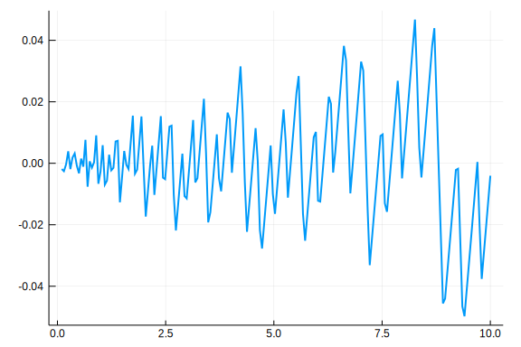

No (https://azul.netlify.com/2018/09/08/programacao-dinamica-i/)[post passado] eu falei sobre programação dinâmica para o caso com tempo finito. Se você não leu, leia: o resto do post não faz sentido sem ler a primeira parte. Vamos finalmente tratar de programação dinâmica em tempo infinito. Relembrando o nosso exemplo é o caso de um consumidor que tem que escolher quanto poupar. Formalmente, queremos resolver um problema do tipo:

$$Max \sum_{t=1}^{\infty} \beta^t u(c_t) \text{ sujeito a } k_{t+1} = (1-\delta)k_t + f(k_t) - c_t$$

A nossa estratégia no post passado era, para cada $t$, resolver o problema:

$$V_t(k_t) = max_{c_t}{} u(c_t) + \beta{} V_{t+1}((1-\delta{}) k_{t})+f(k_t)-c_t)$$

Onde nós sabiamos que o $V_T(k_T)$ era igual a função utilidade avaliada em $k_T$. Ou seja, o agente consumia todo o estoque de capital no último período. Usavamos esse fato para computar $V_{T-1}$, e dai $V_{T-2}$...

Mas agora, somos apresentados a um problema em que não temos um último período, então não podemos prosseguir *recursivamente*. Apesar disso parecer um grande problema, é uma grande vantagem: *o problema de hoje é idêntico ao problema de amanhã*. Como em qualquer período nós ainda temos infinitos períodos a frente, nós podemos escrever o problema do consumidor usando um único $V(k_t)$ - apesar do valor de $k_t$ depender do período, a função $V(k_t)$ não depende mais do período. Nosso novo problema é resolver:

$$V(k_t) = \max_{c_t} u(c_t)+ \beta{} V((1-\delta)k_{t}+f(k_t)-c_t))$$

A beleza de resolver esse problema é que, apesar de não sabermos o valor de V, podemos iterar no computador e encontrar uma aproximação. Isso se deve ao fato de que o problema acima é uma contração, então vale o Teorema do Ponto Fixo de Banach, que o Pedro apresentou aqui. Nosso pseudo-código seria:

* Dê algum chute inicial para $V$. Vamos chamar de $V_0$.
* Resolva $\max_c u(c) + \beta{}V_0((1-\delta)k_{t}+f(k_t)-c))$. Salve isso como $V_1$
* Resolva $\max_c u(c) + \beta{}V_1((1-\delta)k_{t}+f(k_t)-c))$. Salve isso como $V_2$
* Faça isso até $V$ ou $c$ convergirem, i.e., até $V_{i}$ e $V_{i+1}$ (ou $c_i$ e $c_{i+1}$) ficarem próximos numericamente

 Vamos continuar com o nosso exemplo de função utilidade log e função de produção Cobb-Douglas. O caso em que $\delta = 1$ tem solução fechada, então para a gente checar que tudo funcionou direitinho, eu vou implementar ele. Vamos dar, como chute inicial, a função valor sendo idêntica ao valor do capital. É um chute tosco, mas justamente por isso é ilustrativo. Eu sequer vou me preocupar em colocar uma checagem de convergência, para deixar o código o mais simples possível: deixe o computador repetir umas 150 vezes a operação.

````julia
using Optim
using Interpolations
using Plots

u(c)=log(c)

bet = 0.9
alf = 0.5

f(x)=x^alf

y = range(0.1,stop = 10,length = 200)

guess = y
vals = Array{Float64}(undef,150,length(y))
pol = Array{Float64}(undef,150,length(y))

vals[1,1:length(y)] = guess
pol[1,1:length(y)] = y

for i=1:149
  V=LinearInterpolation(y,vals[i,:],extrapolation_bc = Interpolations.Line())
    for j = 1:length(y)
        That(c)=-(u(c)+bet*V(f(y[j]-c)))
        op = optimize(That,0,y[j])
       vals[(i+1),j]=-Optim.minimum(op)
       pol[(i+1),j]=Optim.minimizer(op)
   end
end
````


A solução verdadeira é $c^*(k) = (1-\alpha{} \beta{})k$. Vamos plotar a solução verdadeira contra a estimada:

````julia
sol(Y)=(1-alf*bet)*Y

plot(y,pol[150,1:length(y)] , lab = "Solução estimada", lw = 2, legend = :topleft)
plot!(y,sol(y), lab = "Solução verdadeira", linestyle = :dash, lw = 2)
````


A linha da solução computada parece muito próxima da solução verdadeira, mas um pouco menos suave. A diferença parece ficar pior no final. Vamos fazer um gráfico com a diferença entre as duas soluções:

````julia
dif = sol.(y) - pol[150,:]

plot(y,dif, legend = :none, lw = 2)
````





O gráfico deixa bem claro que a solução difere mais na ponta direita.
