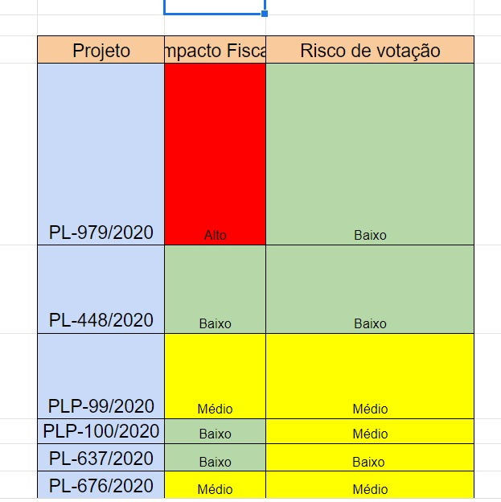
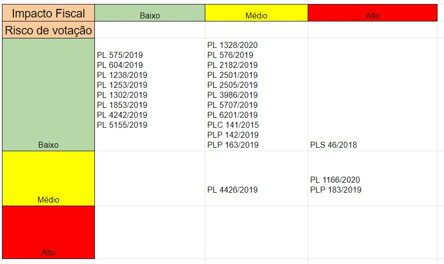

O querido [Daniel Duque](https://twitter.com/dannielduque) trouxe um problema para o meu colo e eu gostei tanto da simplicidade da solução em relação à abordagem mais óbvia de montar loops dentro de loops que decidi aproveitar para espalhar a palavra da programação funcional. Não por inteiro, apenas outra concepção de operações repetidas. 

```{R, include =FALSE}
knitr::opts_chunk$set(message = FALSE, warning = FALSE)
```

Antes do problema interessante do Daniel, um problema comum de simulações estatísticas como motivação. Digamos que nós queremos simular várias normais com médias diferentes. Com loops:

```{R}

library(tidyverse)

n <- 1000

(dados_medias <- tibble(media = seq(-5, 5, .01)))

lista <- as.list(rep(0, nrow(dados_medias)))

for(i in 1:nrow(dados_medias)) {
  
 lista[[i]] <- rnorm(n = n, 
                     mean = dados_medias$media[i])

}

dados_medias$sims <- lista

(dados_finais <- unnest(dados_medias, sims))
```

Tenha em mente que com ``tibbles`` podemos usar listas como colunas, o que não acontece com os dataframes nativos do R então o código poderia ser ainda menos conciso.

Existe outra abordagem para isso. Se entendermos que estamos na verdade aplicando funções várias vezes. ``lista[[i]]] <- ...`` é a composição de duas funções no objeto lista: primeiro localize o i-ésimo elemento em lista e depois atributa o valor ``...``.  

Nós temos dificuldade em enxergar isso de primeira porque está tudo coberto de [_açúcar sintático_](https://pt.stackoverflow.com/questions/12964/o-que-%C3%A9-syntax-sugar-e-como-ela-funciona). Elementos como ``[[]]`` e ``<-``, desenhados para trazer certas comodidades, mas que fazem essas operações parecerem se tratar de algo diferente. 

Levando essa raciocínio mais adiante, ``for`` não é exatamente uma função. Estamos apenas declarando uma uma operação deve ser repetida uma certa quantidade de vezes passando um valor (que usualmente nos referimos como ``i``) tirado de uma lista ou vetor de valores. O que nos impede, no entanto, de pensar em funções que recebem outras funções e as aplicam em elementos variados?

Se por um lado com loops estamos acessando objetos exteriores ao loop o tempo todo - por isso criamos objetos a serem preenchidos no começo do código - não pensamos apenas em uma função que recebe funções? Desse jeito não somos mais obrigados a preparar o terreno antes de um loop, nem mais pensar em índices. Se nomes de funções forem descritivos, é muito mais legível ler declarações do que acompanhar índices. Essas funções que recebem outras se chamam _funções de alta ordem_ e existem em variados sabores. A que reproduz o comportamento de um loop é a ``map()`` do pacote ``purrr``.

Três coisas importantes para se ter em mente:

* R tem jeitos elegantes de lidar com funções que não precisam ser nomeadas, as anônimas. Podemos usar o construtor ``~`` das fórmulas e deixar o pacote se encarregar de traduzir isso numa função, ou explicitamente usar ``function(.x) { ... } ``. Como regra de bolso: se a operação a ser repetida é simples e cabe em uma sequencia curta de código, vale usar a fórmula, se não é melhor construir uma função. 

* O substituto do ``i`` do loop aqui é ``.x``. Isso pode parecer pior no começo, mas tem dois motivos: o ponto no início do nome serve para esse objeto não ir para o seu ambiente global, te poupando alguma dor de cabeça e também porque facilita iterar em objetos diferentes - que você usualmente faria com loops dentro de loops.

* ``map()`` por si só _sempre devolve uma lista_. De vez em quando queremos vetores e fazemos isso especificando o tipo do qual queremos. ``map_dbl()`` devolve números reais de precisão dupla, ``map_chr()`` devolve caracteres, ``map_lgl()`` devolve lógicos, ``map_dfr()`` e ``map_dfc()`` devolvem dataframes empilhados, respectivamente, por linha e por coluna. 

Alguns exemplos:

```{R, error = TRUE}

map(1:10, # dos números de 1 a 10
    ~ rnorm(n = 5, mean = .x)) # tire 5 números da normal com a média dada

map(1:10, function(.x) rnorm(n = 5, mean = .x) ) # mesmo resultado que a abordagem com fórmulas

map_dfc(1:10,
        ~ rnorm(n = 100, mean = .x))

map_dbl(1:10,
        ~ rnorm(n = 100, mean = .x))

```
Note que nem toda conversão a certo tipo de saída funciona. Não podemos pedir que uma lista de vetores saia como um vetor, mas obviamente podemos falar de colar vetores de mesmo comprimento em colunas de um dataframe. Se quisermos uma saída com menos dimensões que uma lista precisamos de outra  função de alta ordem, ``reduce``. Esse padrão [_map-reduce_](https://www.guru99.com/introduction-to-mapreduce.html) é muito comum e tem aplicações interessantes para quem lida com volumes grandes de dados. Alguns exemplos:

```{R, error = TRUE}
map(1:10,
    ~ rnorm(n = 5, mean = .x)) # lista de vetores

map(1:10,
    ~ rnorm(n = 5, mean = .x)) %>%
  reduce(c) # a função c() que combina vetores, apenas um vetor de saída

map(1:10,
    ~ rnorm(n = 5, mean = .x)) %>%
  reduce(cbind) # a função que une coluna a coluna

map(1:10,
    ~ rnorm(n = 5, mean = .x)) %>%
  reduce(rbind) # a função que une linha a linha (do ingles, row)

as.list(1:10) 

as.list(1:10) %>%
  reduce(c)

as.list(1:10) %>%
  reduce(`+`) # podemos usar operadores com aspas

letters

letters %>%
  length() # 26 letras do alfabeto

letters %>%
  reduce(paste) # reduce também aceita fórmulas

letters %>%
  reduce(~ paste(.x)) %>% # reduce também aceita fórmulas
  length() # apenas uma entrada, agora com todas as letras juntas
```

Antes avançar, é importante notar um propriedade muito boa de R: funções são cidadãs de primeira classe e isso explica por que coisas como ``%>% reduce(cbind)`` funcionam. Assim como tibbles, listas, vetores e outras formas de armazenar dados, funções também são objetos e podemos notar isso ao parar de usar ``()`` para sinalizar que aquela função deve ser aplicada (outro açúcar sintático por sinal).

```{R}
Sys.time()
Sys.time

rnorm(10)
rnorm

is.function(`+`) # o operador de soma é uma função?

is.function(`<-`) # o operador de designação é uma função?

is.function(`%>%`) # pipe é uma função?

```

E bem, como podemos substituir o nosso loop de exemplo com esse raciocínio? ``mutate`` do dplyr recebe um dataframe e causa uma mutação em seu estado (adiciona ou mata variáveis, em bom português), já ``unnest`` puxa dados _aninhados_ para fora. Vamos construir então passo a passo:

```{R}
tibble(media = seq(1, 5, .001)) 

tibble(media = seq(1, 5, .001)) %>%
  mutate(sims = map(media, ~ rnorm(1000, .x)))

tibble(media = seq(1, 5, .001)) %>%
  mutate(sims = map(media, ~ rnorm(1000, .x))) %>%
  unnest(sims)
```

Não é tão mais simples que fazer um loop? Existe um custo mental inicial de pensar sobre o código de outro jeito, mas ele logo se paga em soluções mais rápidas e baratas para problemas de todo tipo. Programação funcional te permite ser mais expressivo, fazer mais falando menos. 

Lembra que ao invés de usar ``i`` para nos referir ao valor da iteração, usamos ``.x``? Eu já te dei os motivos, antes de mostrar como isso tudo se aplica num problema prático muito típico, quero mostrar por quê o ``.x`` faz sentido.

Digamos que agora, para cada média sendo usada na simulação dos dados eu queria variar também o desvio-padrão? Estamos simulando dados de uma normal tirado de uma "grade" contendo as combinações de médias e desvios-padrão. Pense um pouco em como abordar esse problema com loops. Você vai adicionar mais uma camada de loop, provavelmente irá se referir ao segundo índice como ``j`` e terá que acompanhar mentalmente duas camadas de peças móveis. Não é muito agradável e o problema piora exponencialmente com cada camada extra adicionada. 

Uma solução muito mais elegante te aguarda usando ``map2()``, que serve para - como o nome entrga - iterar em dois objetos, ``pmap()`` faz isso para um número arbitrário. Para criar a grade com os dados usamos ``expand_grid()``, que gera as combinações. Construindo passo a passo:

```{R}

expand_grid(media = seq(1, 5, .1), sd = seq(1, 5, .1)) # as combinações

expand_grid(media = seq(1, 5, .1), sd = seq(1, 5, .1)) %>%
  mutate(
    sims = map2(
      .x = media,
      .y = sd,
      ~ rnorm(n = 100, mean = .x, sd = .y))
  ) # criando a coluna
  
expand_grid(media = seq(1, 5, .1), sd = seq(1, 5, .1)) %>%
  mutate(
    sims = map2(
      .x = media,
      .y = sd,
      ~ rnorm(n = 5, mean = .x, sd = .y))
  ) %>%
  unnest(sims)

```

Bem, afinal qual é o problema? Bem, alguns projetos de lei estão sendo mapeados de acordo com seu risco de votação e impacto fiscal:



E queremos uma matriz listando os projetos em grupo:



Antes de prosseguir, pense um pouco em como você resolveria isso com loops. Se estiver com paciência, esboce algumas soluções. Vamos gerar dados falsos:

```{R}
library(lorem)
library(glue)

(tabela <- tibble(PL = glue("{ipsum_starts(30)} {ipsum_starts(30)}"),
                  risco = sample(c("alto", "baixo", "médio"), 
                                 size = length(PL), 
                                 replace = TRUE),
                  impacto = sample(c("alto", "baixo", "médio"), 
                                   size = length(PL),
                                   replace = TRUE)
                  ))
```

Vamos passo a passo construir a solução:

```{R}
expand_grid(risco = unique(tabela$risco), 
              impacto = unique(tabela$impacto))  # primeiro uma grade

expand_grid(risco = unique(tabela$risco), 
              impacto = unique(tabela$impacto)) %>%
  mutate(PLs = 
      map2(.x = risco, 
           .y = impacto,
           function(.x, .y) {
              tabela %>% # acessamos a tabela
                filter(risco == .x,  # filtramos para as condições
                       impacto == .y) %>%
                pull(PL) # puxamos o vetor com os nomes de PLs
           })
  ) 

expand_grid(risco = unique(tabela$risco), 
              impacto = unique(tabela$impacto)) %>%
  mutate(PLs = 
    map_chr( # colocamos aquela lista anterior dentro de OUTRO MAP
      map2(.x = risco, 
           .y = impacto,
           function(.x, .y) {
              tabela %>%
                filter(risco == .x, 
                       impacto == .y) %>%
                pull(PL)
           }),
      ~ paste0(.x, collapse = ", ")) # aplicamos paste com collapse
              # dessa forma, os elementos em cada entrada da lista
              # são colapsados no mesmo texto, separados pela ", " 
  ) 

```

Algumas vantagens não são óvbias. A primeira é que é apenas uma expressão a ser executada então você pode ter certeza que nunca terá erros em pedaços específicos do código então *todo* dado resultado dessa operação é válido. Se uma peça móvel falhar, a avaliação toda é cancelada e está claro que há um problema. A segunda é que - apesar de parecer mais difícil no começo - essa abordagem te faz precisar acompanhar menos detalhes da operação si, te liberado para focar no resultado desejado. 

A terceira é que se você inicia uma expressão atribuindo o resultado dessa solução a um objeto, é uma operação _idempotente_, no sentido de que ao ser repetida sempre gera a mesma saída. Se você está sobreescrevendo o mesmo objeto várias vezes, então só terá o mesmo dado se repetir _todas as operações_. Essa é uma preocupação desnecessária se seu código for idempotente. Idempotência é uma propriedade especialmente importante quando se lida com código de execução automática (algo que rode todo dia às 9h da manhã por exemplo). Você *não quer* que um erro no sistema de filas ou execução do código altere o resultado do seus programas.

Se faça um favor, largue os loops.


