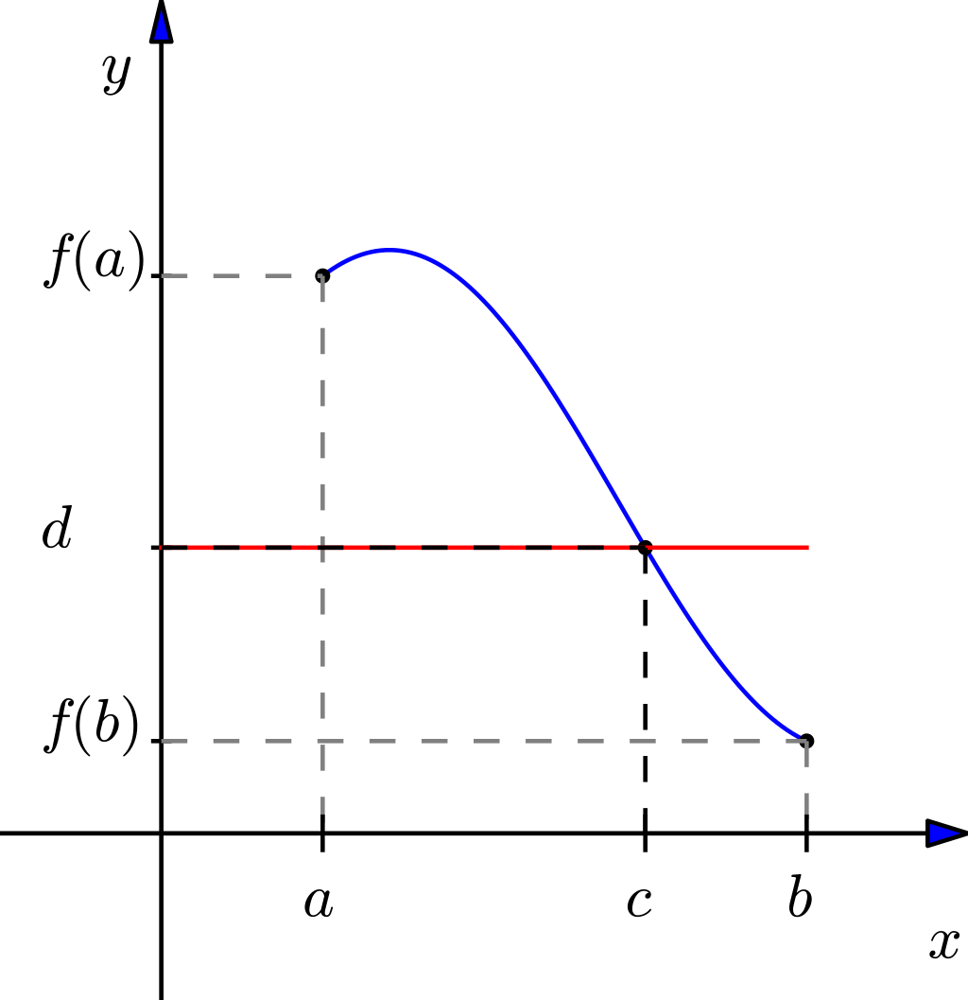
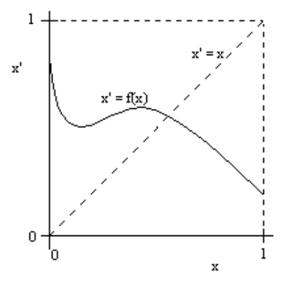
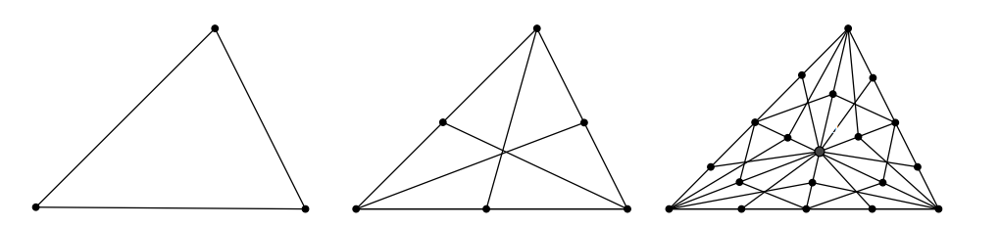
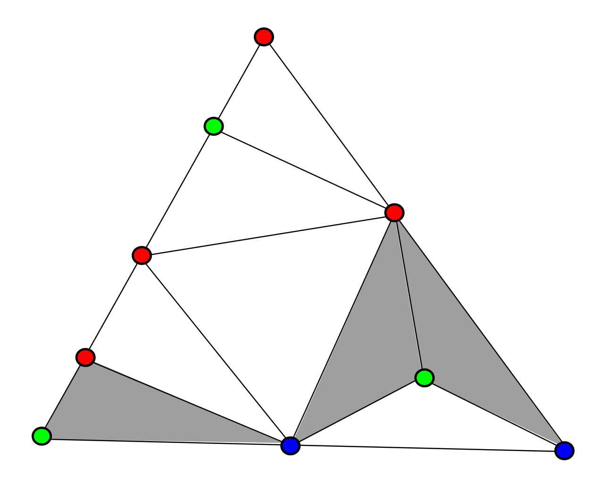

### Um Pequeno Aviso


Este post é um pouco diferente do comum no blog. É definitivamente o mais longo até agora e provavelmente manterá esse título por um bom tempo porque ele foi lentamente concebido e escrito ao longo de 5 semanas de férias da faculdade. Nas minhas últimas férias optei por postar mais posts curtos e apesar de ter gostado da experiência de imersão que esse me proporcionou, não pretendo repeti-la tão cedo.

O que eu planejei a princípio consistia em 4 chunks curtos de código simulando matrizes, encontrando numericamente seus autovetores, diagnosticando um comportamento *bem específico* neles e terminar mostrando como isso é uma consequência do Teorema de Perron-Frobenius, um clássico resultado da Álgebra Linear. Logo eu percebi que o código em si ficava um tanto quanto árido sem um entendimento melhor do teorema, então decidi apresentar a prova dele - muito ilustrativa - no post. 

Aí começou uma cadeia aparentemente interminável de pequenas adições ao humilde post original que acabou ficando tão grande que achei melhor dividi-lo em duas partes. A primeira dá o background matemático com o máximo de intuição que eu consegui. A segunda apresenta a tão aguardada prova do Teorema de Perron-Frobenius (na verdade dois casos particulares porém gerais o suficiente para os nossos propósitos) e os iniciais pedacinhos de código. Um dos lados bons de ser longo é que é um post autocontido. O que o leitor precisa "chegar sabendo" é álgebra linear. Se você sabe o que é um autovetor tem a base necessária. 

Ficaria honrado se você embarcasse nessa pequena jornada pelo mundo dos teoremas de ponto fixo comigo, leitor. 

# Pontos Fixos

Eu sou fascinado por um ramo de matemática que podemos chamar de _Teoria de Ponto Fixo_. É uma teoria surpreendenemte rica, com aplicações vastas e em áreas muito diferentes, de Geometria Algébrica e Ciência da Computação à Economia. As aplicações em economia são particularmente interessantes para quem estuda Equilíbrio Geral ou Teoria dos Jogos. Interessados podem conferir @border. Como eu quero que este post seja auto-contido, vou tentar introduzir os conceitos necessários aqui.

* *Definição:* Diz-se que uma função $f: A \to B$ admite um _ponto fixo_ se existe $x \in A$ tal que $f(x) = x$. $x$ é dito *ponto fixo* de $f$. Notamos o conjunto de pontos fixos de $f$ por $\mathbb{F} (f)$.

No plano cartesiano, nosso velho amigo, uma função admite ponto fixo se cruza o gráfico da *função identidade $g(x) = x$*. A cardinalidade do conjunto de pontos fixos (ou simplesmente o número de pontos fixos) de uma função qualquer nesse contexto é o número de vezes em que a identidade e esta função se cruzam. A função identidade $g(x) = x$ tem infinitos pontos fixos, algumas funções como $f(x) = 5 - x$ têm apenas um ponto fixo e outras como $f(x) = x + 2$ não têm pontos fixos. 

Verificar a (in)existência de pontos fixos em funções afins é bem simples, mas essas funções são raramente interessantes. Procurando por padrões na existência ou não de pontos fixos nasceram vários teoremas. Eu já falei de um deles aqui no blog, o [Teorema do Ponto Fixo de Banach](https://azul.netlify.com/2018/10/31/banach/) que nos garante que se uma função é uma contração e tem domínio em um espaço métrico completo, então tem *um* e somente um ponto fixo. A caixinha de ferramentas de teoremas de ponto fixo é ampla, mas por enquanto vamos focar em um resultado:

* *Teorema (Brouwer):* Seja $A$ um subconjunto fechado, limitado e convexo do $\mathbb{R}^n$ e $f: A \to A$ uma função contínua. Então $f$ admite pelo menos um ponto fixo (ou em símbolos: $\# \mathbb{F} (f) \geq 1$). 

O Teorema do Ponto Fixo de Brouwer é um dos fatos fundamentais da topologia. O enunciado é curiosamente simples para uma conclusão tão forte - embora possa não parecer a princípio. Imagine um disco que contenha a sua borda. Deforme ele como quiser desde que não faça buracos nem entradas. Deforme um disco até que vire um quadrado inscrito no disco original, vire-o ao contrário, crie uma versão menor dele, o que sua mente pensar. Se você não criar buracos nem entradas (portanto deformando-o continuamente e sem ferir a convexidade do conjunto), sempre haverá _pelo menos um ponto_ que fica parado. 

Existem dezenas de maneiras conhecidas de provar este teorema. Algumas provas extremamente simples podem ser construídas se aceitarmos como verdadeiros alguns resultados como o Lema da Não-Retração. Outras muito curiosas podem usar o fato de que o jogo Hex não tem empates, como a de @gale. Como provar o caso geral pode fugir ao escopo de um post de blog, vou apresentar três demonstrações para casos particulares que ilustram facetas diferentes e interessantes do problema. O leitor interessado em demonstrações exaustivas deste resultado pode conferir @buxton.

Eu escolhi as três demonstrações a seguir porque cada uma requer a introdução de conceitos que serão usados na demonstração do Teorema de Perron-Frobenius - além do próprio resultado de Brouwer. Não apenas isso, como também iluminam a conexão entre áreas aparentemente distintas da matemática. Apesar do Teorema do Ponto Fixo de Brouwer ser tipicamente considerado um resultado sobre Topologia, a primeira demonstração se baseia inteiramente em construções do Cálculo, carregando com si uma interpretação geométrica elegante. A segunda demonstração usa fatos de teoria de Homotopias e Geometria Algébrica. A terceira depende inteiramente de ferramentas da Combinatória.

## O Teorema Elementar de Ponto Fixo

Este caso particular do principal resultado é o melhor ponto de partida porque pode ser demonstrado até mesmo com desenhos em um papel. Sua demonstração formal depende apenas de um resultado do Cálculo que alunos de primeiro período conhecem, o Teorema do Valor Intermediário, e daí decorre em uma sequência muito simples de encadeamentos lógicos. Neste contexto, demonstrar a proposição é equivalente a mostrar que nenhuma linha que vá de um lado de um quadrado até o oposto sem dar pulos necessariamente cruza a diagonal. 

* *Teorema (Valor Intermediário):* Seja $f$ uma função contínua, $a$ e $b$ números reais tal que $a < b$. Então para todo $d \in (f(a),f(b))$ existe $c \in (a,b)$ tal que $f(c) = d$.

Este teorema tem uma interpretação visual bem simples: 

```{r echo=FALSE, out.width='100%', dpi = 180}

```

Agora podemos prosseguir para a demonstração em si.

* *Proposição (Brouwer no Fechado $[0,1]$):* Seja $I=[0,1]$ um intervalo unitário fechado. Suponha $f$ um mapeamento contínuo de $I$ em $I$. Então para pelo menos um $x \in I$ vale que $f(x)=x$.

* *Demonstração:* Poderíamos ter dois casos "triviais", em que $f(0)=0$ ou $f(1)=1$. Se não tivermos tais casos, então temos um mapeamento que associa todos os pontos de $I$ a um subconjunto de $I$ tal que $f(0)>0$ e/ou $f(1) < 1$ . Se definirmos um mapeamento $g(x)= f(x) - x$, temos que $g(0) > 0$ e $g(1) < 0$. Segue do Teorema do Valor Intermediário que existe algum $p \in I$ tal que $g(p) = 0 \iff f(p) - p = 0$. Se $f(p) - p = 0$ então $f(p)=p$. 

É uma demonstração simples. Mostramos que se não tivermos casos triviais como $f(0) = 0$ ou $f(1) = 1$ então necessariamente precisamos ter algum ponto fixo no interior do conjunto. Este fato aparentemente algébrico tem uma consequência geométrica clara e um tanto quanto intuitiva: se quisermos traçar um caminho entre lados opostos de um quadrado precisamos tocar sua diagonal - nem que seja em algum vértice do lado oposto[^1].

```{r echo=FALSE, out.width='100%', dpi = 180}

```

## Provando com o Lema da Não-Retração

Primeiro preciso apresentar duas definições.

* *Definição:* Nos referimos ao $n$-disco como $D^n$ e o definimos como $D^n = \{ x \in \mathbb{R}^n ; ||x|| \leq 1\}$. Note então que o $n$-disco é sempre fechado, convexo e limitado, não importando em quantas dimesões estamos. Podemos nos refeir ao $n$-disco *aberto*, em que na definição trocamos a desigualdade fraca por uma desigualdade estrita. A partir daí podemos também definir a $n$-esfera como sendo a borda do $D^{n+1}$. Notamos a $n$-esfera como $S^n$.

O $D^1$ é o intervalo fechado da reta $[-1,1]$, o $S^0$ é apenas o conjunto $\{-1, 1\}$.

* *Definição:* Dizemos que uma função $\rho : A \to B \subset A$ é uma _retração_ se é (i) contínua e (ii) para todo $x \in B$ vale que $\rho(x) = x$. 

Retrações são funções contínuas que mapeiam um conjunto em um subconjunto de si mesmo de forma que qualquer elemento que já pertença ao subconjunto em questão seja um ponto fixo. Tome a função $f: [-1,1] \to [0,1]$ definida por $f(x) = |x|$. Estamos falando de uma retração! Todos os elementos que já pertenciam ao subconjunto que é imagem de $f$ são pontos fixos e todos que não pertenciam são mapeados lá. Com essas duas definições, posso apresentar um resultado muito curioso:

* *Lema (Não-Retração):* Não existe função $\rho : D^{n+1} \to S^n$ tal que $\rho$ seja uma retração. 

Se uma função é contínua de um disco para sua fronteira, então necessariamente não pode ter todos os pontos da fronteira como pontos fixos e se apresenta todos os pontos da fronteira como pontos fixos necessariamente não é contínua. A prova que parece ser mais famosa usa argumentos topológicos que fogem ao escopo do que é apresentável em um só post, homotopias. A demonstração mais simples que encontrei é a de @kannai, que usa argumentos vindos do "cálculo de engenharia".

A prova a seguir é interessante porque ilustra o status de *fato* do Teorema do Ponto Fixo de Brouwer para os não-iniciados. Iremos supor, por questão de absurdo, que ele não é verdadeiro e a partir daí concluiremos que um outro fato - o Lema da Não-Retração - também não é verdadeiro. Ora, se criamos uma hipótese que implica em um fato provado ser falso, deve ser porque esta hipótese é falsa, não?

* *Proposição (Brouwer no $D^2$):* Seja $f: D^2 \to D^2$ um mapa contínuo, então $\#\mathbb{F}(f) > 0$ (e.g. $f$ admite pelo menos um ponto fixo).

* *Demonstração:* Toma um mapa contínuo $f: D^2 \to D^2$ e suponha por absurdo que $f$ não admite ponto fixo. Defina a função $r:D^2 \to S^1$ da seguinte maneira: tome o ponto $f(x)$ e ligue-o a $x$ por uma reta. Extenda a reta até que toque a borda do $D^2$. $r(x)$ é o ponto em que esta reta toca a borda do disco. Note que se $x$ já pertence à borda, $r(x) = x$. Como a função $r$ é apenas uma composição de retas, podemos concluir que é contínua *se* $x \neq f(x)$. Se tivermos $x = f(x)$, então não poderemos compor uma reta entre $x$ e $f(x)$, $r(x)$ não estaria definida e não teríamos uma retração. Como começamos nossa demonstração supondo que $f$ não admite ponto fixo, temos então que $r$ é uma retração do $D^2$ para o $S^1$, o que contraria o Lema da Não-Retração. Então nossa hipótese está claramente errada e $f$ deve admitir pelo menos um ponto fixo. 


## Uma demonstração com Combinatória

Esta talvez seja, das três, a mais complicada - mas falo isso vindo de um passado de sofrimento com Combinatória. O contexto mais discreto e com menos apelos à Topologia ou Cálculo pode ser mais agradável para alguns leitores. Vamos primeiro generalizar a noção de polígono para dimensões mais altas, depois nos familiarizar com mais amigáveis Simplexos. Depois vamos abordar as Colorações de Sperner - formas de categorizar vértices - e conhecer o Lema de Sperner, um resultado que garante certas propriedades de Colorações de Sperner. 

* *Definição:* O *$n$-simplex padrão* (denotado por $\Delta_n$) é o conjunto de combinações convexas de $n+1$ vértices $\{v_1,v_2,...,v_{n+1}\}$ cujas somas de entradas são iguais a $1$. Explicitamente, $\Delta_n = \{ \sum_{i=1}^{n+1} \theta_i v_i \,\,;\,\, \sum v_i = 1 \,\, \& \,\, \theta_i > 0 \,\, \& \sum \theta_i = 1\}$.

A definição pode parecer seca, mas simplexos são objetos de fato objetos simples. O $0$-simplex é apenas um ponto, o $1$-simplex é um segmento de reta, o $2$-simplex é um triângulo e o $3$-simplex é um tetraedro, por exemplo. 

* *Definição:* Uma *divisão baricêntrica simplicial* de um $n$-simplexo é uma partição de $\Delta_n$ em simplexos menores (que chamaremos de *células*) de forma que quaisquer duas células sejam disjuntas ou compartilhem apenas uma única face. 

```{r echo=FALSE, out.width='100%', fig.cap= "O 2-simplexo e suas duas primeiras divisões baricêntricas simpliciais"}

```

* *Definição:* Uma *coloração de Sperner* de uma divisão baricêntrica simplicial é a associação de $n+1$ cores aos vértices da subdivisão de forma que pontos em cada face do simplexo original tenham apenas as cores dos vértices que definem a respectiva face.


* *Lema (Sperner):* Toda coloração de Sperner de uma divisão baricêntrica simplicial contém pelo menos uma célula cujos vértices têm todas as cores diferentes.

A prova em uma dimensão divertida e perspicaz, a prova do caso geral já não me evoca grandes reações então deixarei apenas um esboço aqui. É um resultado conhecido e o leitor não terá dificuldades em encontrar uma demonstração completa e rigorosa.

* *Prova (Caso $n=1$):* Tome o segmento de reta $(a,b)$, colora $a$ com uma cor e $b$ com outra. Agora tome uma divisão baricêntrica simplicial de $(a,b)$ e colora os vértices da subdivisão com $2$ cores. Como $a$ e $b$ têm cores diferentes, ao ir de $a$ para $b$ precisamos trocar de cor um número ímpar de vezes então existe algum número ímpar de células com cores diferentes.

```{r echo=FALSE, out.width='100%', fig.cap= "Uma coloração de Sperner para o $2$-simplexo. Note que existe um número ímpar de células cujos vértices tem todos cores diferentes: é uma consequência do Lema de Sperner."}

```

* *Prova (Esboço do Caso Geral):* Defina dois tipos de células, as que recebem todas as $n+1$ cores e as que não recebem - de forma que as que não recebam precisem repetir uma cor pelo menos uma vez. Considere agora as faces (que podem no máximo ser partilhadas por células) com $n-1$ dimensões que usam exatamente $n$ cores. Elas podem estar no exterior do simplexo ou no interior. Uma célula que use todas as $n+1$ cores contribui com apenas uma face de $n$ cores enquanto as células que repetem uma cor contribuem com duas. Podemos então definir uma identidade que relaciona a quantidade de faces e de células de cada tipo. Como cada face tem uma coloração de Sperner associada, cada face contém pelo menos um número ímpar de subcélulas com vértices todos de cores diferentes, então existe um número ímpar de faces no exterior do simplexo. Ao considerar este fato em conjunção com a identidade que relaciona os números de faces e de tipos de células, concluímos que existe um número ímpar de células que recebem todas as $n+1$ cores.

* *Proposição (Brouwer em $n$ dimensões):* Seja $f: \Delta_n \to \Delta_n$ uma função contínua. $f$ admite pelo menos um ponto fixo.

* *Prova:* Defina $f: \Delta_n \to \Delta_n$. Escolha $p \in \Delta_n$. Por definição vale que $\sum p_i = \sum f(p)_i = 1$. Se $p$ não for um ponto fixo então vale que pelo menos uma entrada $j$ de $f(p)$ é maior ou igual à entrada equivalente de $p$ e vice-versa: $p_j \geq f(p)_j$. Associe agora uma coloração do simplexo de forma que a cor (das $n+1$ cores) de cada vértice seja associada à entrada $j$ tal que $f(p)_j \geq p_j$. Temos uma coloração de Sperner então pelo Lema de Sperner existe pelo menos uma célula toda colorida com cores diferentes, o que implica a existência de um vetor $p$ que satisfaz $f(p)_j \geq p_j$ em *todas as entradas*. No entanto, como $f$ mapeia o simplexo nele mesmo, a soma das coordenadas de $f(p)$ e $p$ precisam ser iguais, então temos pelo menos um vetor $p$ tal que $f(p)_j = p_j$ em todos os índices. Este vetor é um ponto fixo de $f$ e aqui acaba a demonstração. 


# Contrações e seu ponto fixo

Eu já falei do [Teorema do Ponto Fixo de Banach](https://azul.netlify.com/2018/10/31/banach/) aqui no blog antes então irei brevemente recapitular do que se trata e não quebrar a tradição de sempre ilustrar a magia acontecendo com a ajuda do R.

Dizemos que uma função contínua $f$ é uma *contração* se para qualquer par de pontos no domínio $D$ vale que a distância $d(x,y) > d(f(x), f(y))$. O Teorema do Ponto Fixo de Banach nos diz então que se estamos em um espaço métrico _completo_ (um espaço "sem buracos", como os números reais) então $f$ tem um e apenas um ponto fixo. Mais ainda, podemos encontra-lo aplicando $f$ repetidamente em um ponto inicial qualquer. A sequência com os resultados converge para o ponto fixo de $f$. 

Vamos demonstrar este resultado:

Tome $f$ contínua com derivada limitada superiormente por $k$ tal que $|k| <1$. $d(x,y)$ é a distância entre dois pontos. Pela desigualdade triangular, temos:

$$d(x,y) \leq d(x, f(x)) + d(f(x), f(y)) + d(y, f(y))$$
$$d(x,y) \leq d(x, f(x)) + kd(x, y) + d(y, f(y))$$
Podemos então isolar $d(x,y)$:
$$d(x,y) - kd(x, y) \leq d(x, f(x))  + d(y, f(y))$$
$$d(x,y) \leq \frac{d(x, f(x))  + d(y, f(y))}{1 - k}$$

Note que se $x$ e $y$ forem pontos fixos, vale que $d(x, f(x)) = 0$ e $d(y,f(y)) = 0$ então $d(x,y) = 0$, portanto, $x=y$. Podemos garantir que uma contração somente terá _um_ ponto fixo com essa observação. Resta mostrar agora que a sequência descrita no enunciado é de Cauchy - que a distância entre seus termos é cada vez menor, no informal português. Se $f^n(t)$ for a $n$-ésima aplicação de $f$ com ponto inicial em $t$, $x = f^n(x_0)$ e $y = f^m(x_0)$, então podemos substituir isso tudo na desigualdade anterior:

$$d(f^n(x_0),f^m(x_0)) \leq \frac{d(f^n(x_0), f(f^n(x_0)))  + d(f^m(x_0), f(f^m(x_0)))}{1 - k}$$
$$d(f^n(x_0),f^m(x_0)) \leq \frac{k^nd(f(x_0), x_0)  + k^md(f(x_0), x_0)}{1 - k}$$
$$d(f^n(x_0),f^m(x_0)) \leq \frac{k^n + k^m}{1-k}d(f(x_0), x_0)$$

Observe que isso converge a zero, à medida que $n,m \to \infty$. Afinal, por $k$ ser menor em módulo do que $1$, o que caracteriza uma função $f$ contínua como contração, temos que:

$$\lim_{n,m \to \infty} \frac{k^n + k^m}{1-k} = 0$$

Então a distância de quaisquer dois elementos daquela sequência descrita no enunciado converge a zero à medida que o índice da sequência aumenta - logo ela é Cauchy e aqui acaba a demonstração. Partindo de um ponto inicial qualquer, basta aplicarmos repetidamente uma contração que teremos uma sequência que converge ao *único* ponto fixo dessa contração. Temos não só existência garantida, como também unicidade. 

Vamos ver esse resultado ocorrendo? Vamos simular vários vetores do $\mathbb{R}^2$ e aplicar uma contração neles.

```{R message = FALSE, warning = FALSE, dpi = 180}

library(dplyr)
library(gganimate)

f = function(x,k) k*x # função
set.seed(1234)
n = 1000 # quantos vetores
t = 20 # quantas iterações

lista = list() # lista vazia a ser preenchida
  
for(j in 1:n) {

  vetor = rnorm(n = 2, sd = 4) %>% round(digits = 2) # inicializamos um vetor
  
  DF = data.frame(R1 = double(length = t),
              R2 = double(length = t),
              tempo = double(length = t))
  
  DF$R1[1] = vetor[1]
  DF$R2[1] = vetor[2]
  DF$t[1] = 1
 
  for(i in 2:t) {

  indice = i - 1  
  
  vlinha = double(length = 2)
  vlinha[1] = DF$R1[indice]
  vlinha[2] = DF$R2[indice]
  
  k = .9 # qualquer k positivo e menor que 1 implica que f é contração

  vlinha = f(vlinha, k = k)  

  R1 = vlinha[1]
  R2 = vlinha[2]
  

  DF$R1[i] = R1 
  DF$R2[i] = R2
  DF$tempo[i] = indice + 1
  
  }
  
  lista[[j]] = DF
  
  rm(vetor) # nos livramos do vetor

}
 
DF = do.call(rbind, lista) # unimos tudo


g = DF %>% ggplot(aes(x = R1, y = R2, colour = tempo)) + 
  theme(legend.title = element_blank(),
        legend.position = "none") +
  geom_point() + 
  geom_density_2d() +
  transition_time(tempo) +   
  ease_aes('linear') +
  labs(x = "",
       y = "")

animate(g, fps = 30)
```


```{R echo = FALSE}
anim_save("banach.gif")
```


# Referências


[^1]: O incrível Daniel Coutinho notou que a mesma demonstração vale para um caso mais geral que a função não necessariamente está no fechado $[0,1]$, apenas $f(0), f(1) \in [0,1]$. Nesse caso o resultado também vale! 


